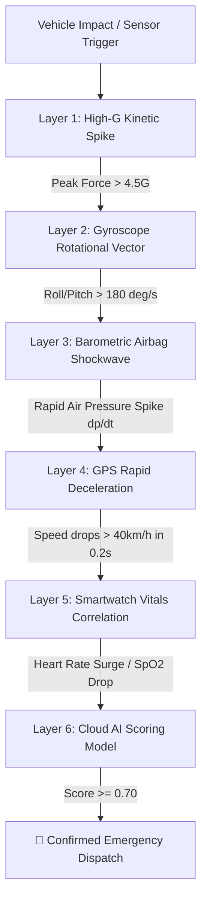

# 🧠 AI Crash Detection & 6-Layer Anti-Fake Verification

Accidental triggers, dropped phones, potholes, and malicious false alarms waste critical emergency resources. SERS introduces a multi-tier verification engine executing in **under 500 milliseconds**.

---

## 🔬 The 6-Layer Anti-Fake Pipeline

---

## 📊 Layer Specifications

### Layer 1: High-G Kinetic Accelerometer Spike
- Measures instantaneous 3-axis force ($F = \sqrt{a_x^2 + a_y^2 + a_z^2}$).
- Drops below 3.5G are categorized as minor drops or normal vehicular vibrations.

### Layer 2: Gyroscope Angular Velocity & Roll Analysis
- Evaluates vehicle rollover, spin-outs, or high-speed lateral yaw.
- Potholes produce vertical axis acceleration without sustained multi-axis angular velocity.

### Layer 3: Barometric Airbag Pressure Shockwave ($\frac{dp}{dt}$)
- Vehicle airbag deployments create a rapid, unmistakable cabin air pressure wave (5–15 hPa rise in <30ms).
- Barometric sensor sampling confirms high-energy airbag detonation inside the vehicle cabin.

### Layer 4: GPS Telemetry & Post-Impact Deceleration
- Validates that the vehicle was in transit (>25 km/h) prior to the impact and came to an abrupt, abnormal stop.

### Layer 5: Smartwatch Photoplethysmography (PPG) Vitals
- Correlates victim physiological stress response: sudden heart rate spike ($HR > 120$ bpm) or acute bradycardia from trauma shock.

### Layer 6: Fast-Inference ML Severity Scoring Engine
- Python FastAPI microservice computes a calibrated Severity Index ($0.00 \to 1.00$) based on vehicle velocity, force vectors, and victim age/medical profile.

---

## 🛡️ False Alarm Elimination Matrix

| Scenario | Accel G | Baro Wave | Speed Drop | Smartwatch | SERS Verdict |
| :--- | :--- | :--- | :--- | :--- | :--- |
| **Phone dropped on floor** | High (5G) | ❌ None | ❌ None (0 km/h) | 🟢 Normal | ❌ **REJECTED (No SOS)** |
| **Pothole / Speed bump** | Moderate (3G) | ❌ None | ❌ Gradual | 🟢 Normal | ❌ **REJECTED (No SOS)** |
| **Highway Collision** | High (8G+) | 🟢 DETECTED | 🟢 >60 to 0 km/h | 🔴 HR Surge | 🚨 **CONFIRMED EMERGENCY (0.94)** |
| **Rollover Accident** | Extreme (12G) | 🟢 DETECTED | 🟢 High Spin | 🔴 HR Surge | 🚨 **CONFIRMED EMERGENCY (0.98)** |
