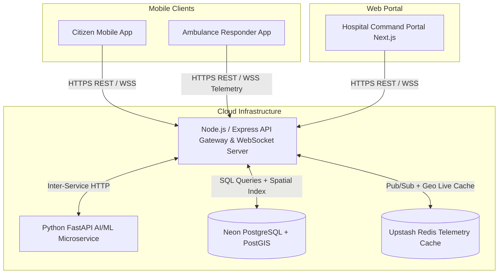

# 🏗️ System Architecture & Data Layer

SERS is built as a production-grade monorepo combining real-time streaming, spatial geofencing, microservice AI scoring, and distributed telemetry caching.

---

## 🏛️ High-Level Architecture



---

## 📦 Monorepo Structure

```
SERS/
├── apps/
│   ├── mobile/           # React Native / Expo Mobile App (Citizen & Responder)
│   └── web-admin/        # Next.js 14 / TailwindCSS Hospital Command Center
├── services/
│   ├── api/              # Node.js + Express + Socket.io Real-Time API Gateway
│   └── ml-service/       # Python FastAPI Machine Learning Crash & Routing Engine
├── infrastructure/       # Docker configurations and deployment scripts
├── docs/                 # Documentation, Architecture Matrix & Wiki
└── synopsis/             # Research paper & project synopsis LaTeX sources
```

---

## 🗄️ Database Schemas (PostgreSQL + PostGIS)

The database utilizes **PostGIS spatial indexing (`GEOGRAPHY(Point, 4326)`)** for lightning-fast radial ambulance dispatch within sub-10ms latency:

### Core Tables:
1. **`users`**:
   - Authentication records, role mapping (`citizen`, `responder`, `hospital_staff`, `admin`), hashed passwords (bcrypt), and account status.
2. **`citizens`**:
   - ABHA ABDM ID, Govt ID proof (Aadhaar/PAN/DL/Voter), Blood Group, Primary Emergency Contacts, and Vehicle Registration Number.
3. **`responders`**:
   - Responder Badge ID, Emergency Ambulance Vehicle Reg Number, Emergency Driving License, Active Dispatch Status, and Live Location Coordinates.
4. **`hospitals`**:
   - Geographic coordinates, Trauma Level rating (1, 2, 3), total/available ICU beds, ER beds, Ventilators, and Oxygen inventory reserves.
5. **`emergencies`**:
   - Incident severity score (0.00 - 1.00), sensor telemetry dumps, 6-layer verification log, assigned ambulance, target hospital, and lifecycle status.
6. **`doctor_attendance`**:
   - Live medical staff clock-in, duty status (`on_duty`, `in_ot`, `on_call`, `off_duty`), specialty, and direct trauma pager routing.
7. **`telemetry_logs`**:
   - High-frequency GPS breadcrumbs, speed, heading, and live vitals streaming during Golden Hour transit.

---

## ⚡ Real-Time Telemetry & Caching (Redis)

- **Active Incident Pub/Sub**: Real-time broadcast of newly confirmed emergencies to all hospital emergency rooms and nearby responders.
- **Geospatial Hotspots**: Live `GEOADD` and `GEORADIUS` indexing of moving emergency vehicles.
- **OTP Rate Limiting & Ephemeral TTL**: 5-minute sliding window expiration for two-factor authentication codes.
